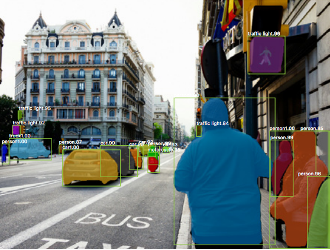
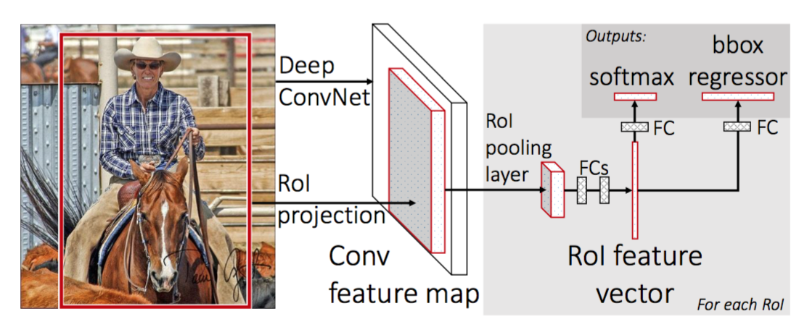
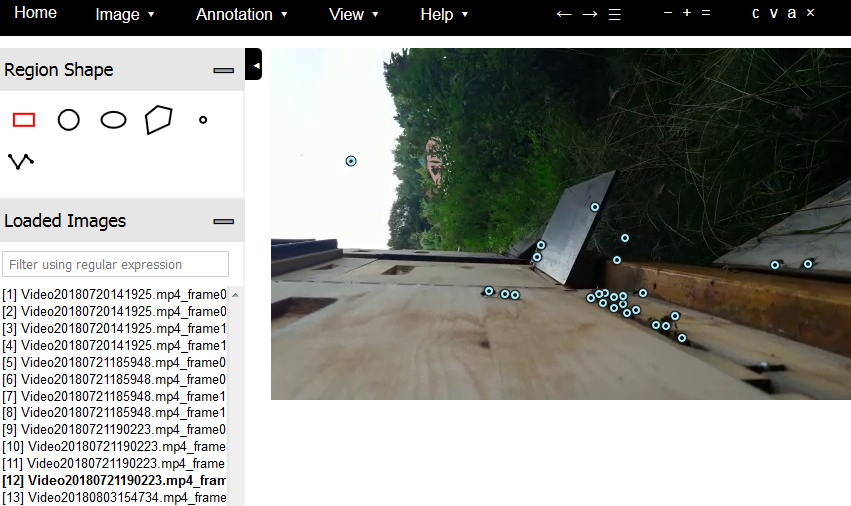
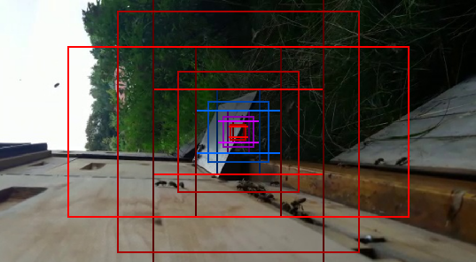
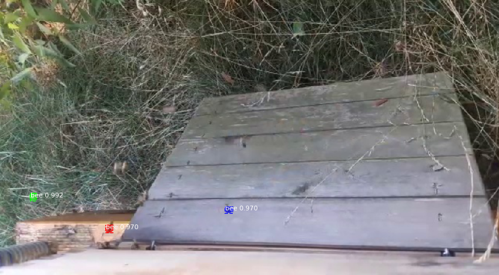
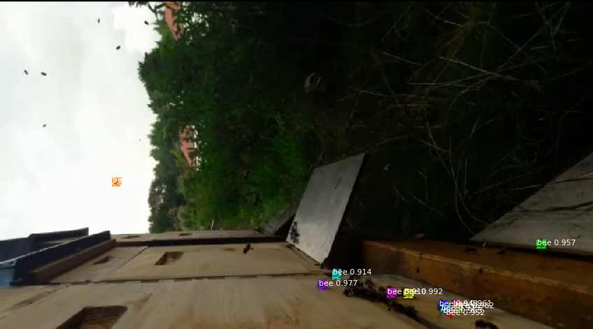

```{r setup, include=FALSE}
options(htmltools.dir.version = FALSE)
```


## Motivation

- My wife is a beekeeper 
- She would like to know how high the bee traffic is
- Can we count the number of bees coming and going over time?


- **Goals**: 
    - Analyze bee traffic over time using data collected from a webcam 
    - Develop an app which shows the number of bees on a real-time video
    
Sounds like an application for deep learning...


---

<!-- https://blog.athelas.com/a-brief-history-of-cnns-in-image-segmentation-from-r-cnn-to-mask-r-cnn-34ea83205de4 -->

## CNN


- **Convolutional Neural Networks** (CNNs): gold standard for image classification
- Usually there is an image with one single object instance and the focus of the task is to say what that image is showing

.pull-left[
- We need **object detection/segmentation** here
- For counting objects we have the following challanges:
    - type of the objects to be counted
    - overlapping
    - perspective view
    - the minimum size of detected objects
    - training and testing speed
]

.pull-right[

]


<!--
.pull-right[

]
-->

<!--  -->
<!--  -->
    

---

## R-CNN 

- **Region-based Convolutional Neural Networks** (R-CNN)
- [Girshick et al., 2014](https://arxiv.org/abs/1311.2524)
- Purpose is to solve the problem of object detection
- Given a certain image, we want to be able to draw bounding boxes over all of the objects

- **Region proposal step**:
    - *Selective search* generates 2000 different object regions with the highest probability of containing an object
    - Proposals are “warped” into an image size that can be fed into a pre-trained CNN (e.g. AlexNet)
    - A feature vector is extracted for each region

- **Classification step**:
    - Use a trained SVM to classify each feature vector for each class independently
    - Use a simple bounding-box regression with each feature vector to obtain the most accurate coordinates


---

## R-CNN 


Speed Bottleneck:

- Running selective search to propose 2000 region candidates for every image
- Generating the CNN feature vector for every image region (N images * 2000)


---

## Fast R-CNN

- [Girshick et al., 2015](https://arxiv.org/pdf/1504.08083.pdf): Union three independent models into one, named *Fast R-CNN*
- That Last layer of a pre-trained CNN is replaced by a RoI pooling Layer

- **RoI (Region of Interest) Pooling**: 
    - Run CNN once per image (instead of 2000 times) and share computation across proposals
    - Many region proposals of the same images are highly overlapped

- **Combine All Models into One Network**:
    - Jointly train the CNN, classifier, and bounding box regressor in a single model.

---

## Fast R-CNN



Speed Bottleneck:
- Fast R-CNN is faster in both training and testing time. 
- However, the improvement is not dramatic because the region proposals are generated separately by another model and that is very expensive.

---

## Faster R-CNN

- Integrate the region proposal algorithm into the CNN model for speedup 

- [Ren et al., 2016](https://arxiv.org/abs/1506.01497): construct a single model composed of
    - **Region proposal network (RPN)**: set of object proposals with objectness score
    
    - fast R-CNN with shared convolutional feature layers:
        - Slide a small (3 x 3) network over the convolutional feature map 
        - Map to lower-dimensional feature 256-d
        - Box-regression layer (reg)
        - Box-classification layer (cls)
        - **Anchors**: Predict $k$ proposals relative to $k$ reference boxes
    
---

## Faster R-CNN


---

## Mask R-CNN

- So far: CNN features to locate different objects in an image with bounding boxes.

- Mask R-CNN [He et al., 2017](https://arxiv.org/abs/1703.06870) extends Faster R-CNN to pixel-level image segmentation. 

- Use **RoIAlign** instead of RoI Pooling: avoids pixel-wise rounding problems

- Output: **binary mask** that says whether or not a given pixel is part of an object

- It can also color pixels in the bounding box that correspond to that class
<!-- - Self-Driving Cars need to know the exact pixel location of the road; 
  potentially of other cars as well to avoid collisions -->

---

## Mask R-CNN

Combination of

- Faster R-CNN for object detection (class and bounding box)
- FCN (Fully Convolutional Network): pixel wise boundary


---

## Building a Mask R-CNN Model for Counting Bees

- A Mask R-CNN implementation on Python 3, Keras and Tensorflow is used
- 4 videos next to the hive in different perspectives with a length of about 1 minute where recorded
- From each video 20 frames where extracted
- These are devided into train (16 images), validation (8 images) and test (56 images) dataset
- Annotating the train data using an online tool



<!--  -->

---

## Anchors




---

## Training the model

- COCO Dataset consists of 330,000 images with more than 200,000 images labeled with 80 object categories
- The COCO pre-trained model is used as the checkpoint for transfer learning

- **Transfer learning**: adaptation of pretrained models to similar or moderately different tasks, 
by finetuning parameters of the pretrained models

- Training the model on a server with 250 gigabyte RAM and 32 cores (without GPU) for 10 epochs took about 12 
  hours

---

## Results (1)





---

## Results (2)




---

## Summary

- As a proof of concept the approach seems to work

- But...
    - We need to label more data to improve the results
    
    - The prediction seems somehow slow
    
    - Maybe use polygons instead of single pixels to get it work for near perspectives
    
    - Try other approaches like YOLO or SSD as they can achieve higher framerates
    

---


## Literature

- https://blog.athelas.com/a-brief-history-of-cnns-in-image-segmentation-from-r-cnn-to-mask-r-cnn-34ea83205de4
- https://medium.com/@umerfarooq_26378/from-r-cnn-to-mask-r-cnn-d6367b196cfd
- http://matpalm.com/blog/counting_bees/
- https://softwaremill.com/counting-objects-with-faster-rcnn/
- https://lilianweng.github.io/lil-log/2017/12/31/object-recognition-for-dummies-part-3.html

- R-CNN: https://arxiv.org/abs/1311.2524
- Fast R-CNN: https://arxiv.org/abs/1504.08083
- Faster R-CNN: https://arxiv.org/abs/1506.01497
- Mask R-CNN: https://arxiv.org/abs/1703.06870

- Mask R-CNN Implementation: https://github.com/matterport/Mask_RCNN

